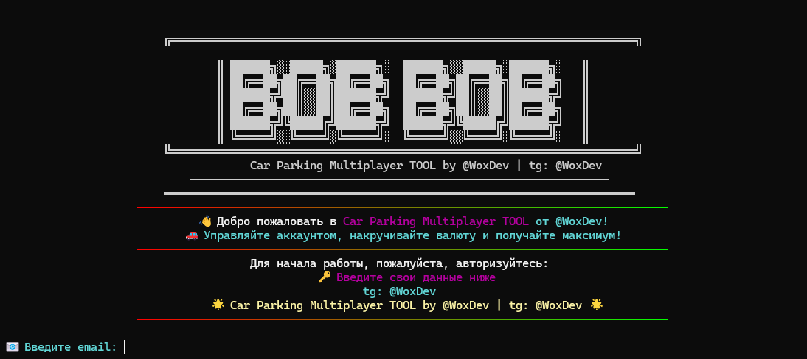

# BOB BOB



**Car Parking Multiplayer TOOL**

Связаться с разработчиком: [Telegram @WoxDev](https://t.me/WoxDev)

---

## 📜 Описание

Это инструмент для игры Car Parking Multiplayer, который предоставляет расширенные возможности по управлению игровым аккаунтом, включая накрутку внутриигровой валюты и получение максимальных преимуществ.

---

## ✨ Возможности

-   Управление аккаунтом
-   Накрутка валюты (монеты, доллары)
-   Получение максимальных бонусов и улучшений

---

## 🛠️ Установка CpmTermux

### Предварительные требования

* **Termux**: Убедитесь, что у вас установлен Termux. Рекомендуется скачивать его с [официального репозитория F-Droid](https://f-droid.org/packages/com.termux/) для получения актуальных и безопасных версий.

### Шаги установки

1.  **Откройте Termux** и обновите системные пакеты до последних версий:
    ```bash
    pkg update && pkg upgrade -y
    ```

2.  **Установите необходимые пакеты**: Git (для клонирования репозитория), Python (для запуска скрипта `main.py`) и libsecret (может использоваться для управления учетными данными):
    ```bash
    pkg install git python -y
    ```

3.  **Клонируйте репозиторий CpmTermux** на ваше устройство:
    ```bash
    git clone https://github.com/B880OO/CpmTermux.git
    ```

4.  **Перейдите в директорию** с загруженным проектом:
    ```bash
    cd CpmTermux
    ```

5.  *(Опционально)* **Предоставьте права на выполнение** основному скрипту, если вы планируете запускать его напрямую (например, `./main.py` вместо `python main.py`). Это требуется, если в начале скрипта `main.py` есть корректная строка shebang (например, `#!/usr/bin/env python`):
    ```bash
    chmod +x main.py
    ```

---

## 🚀 Как начать работу

1.  Убедитесь, что вы находитесь в директории проекта `CpmTermux` в Termux.
2.  **Запустите инструмент** с помощью Python:
    ```bash
    python main.py
    ```
    Или, если вы выполнили опциональный шаг 5 из установки и скрипт это поддерживает:
    ```bash
    ./main.py
    ```
3.  При первом запуске или по требованию программы авторизуйтесь, введя свои данные:
    * Email
    * Password
4.  После авторизации вы получите доступ к возможностям инструмента. Следуйте инструкциям на экране.

---

## 📞 Контакты

* **Разработчик:** [@WoxDev](https://t.me/WoxDev) (Telegram)

---

## ⚠️ Внимание

Использование сторонних инструментов для модификации игр, таких как Car Parking Multiplayer, может нарушать условия предоставления услуг разработчиков игры. Это может привести к временной или постоянной блокировке вашего игрового аккаунта.

**Используйте данный инструмент на свой страх и риск. Разработчик инструмента не несет ответственности за возможные негативные последствия для вашего игрового аккаунта.**
